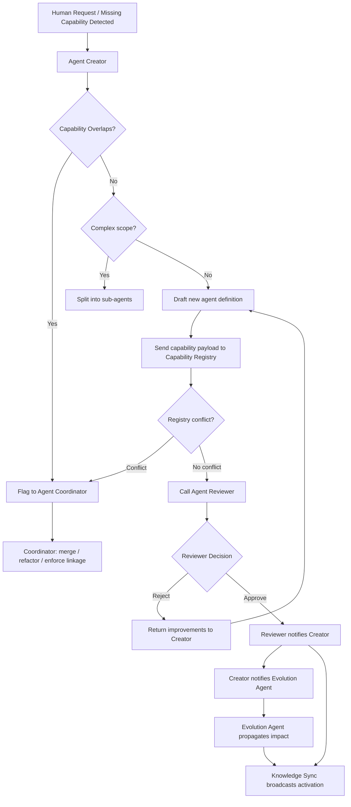
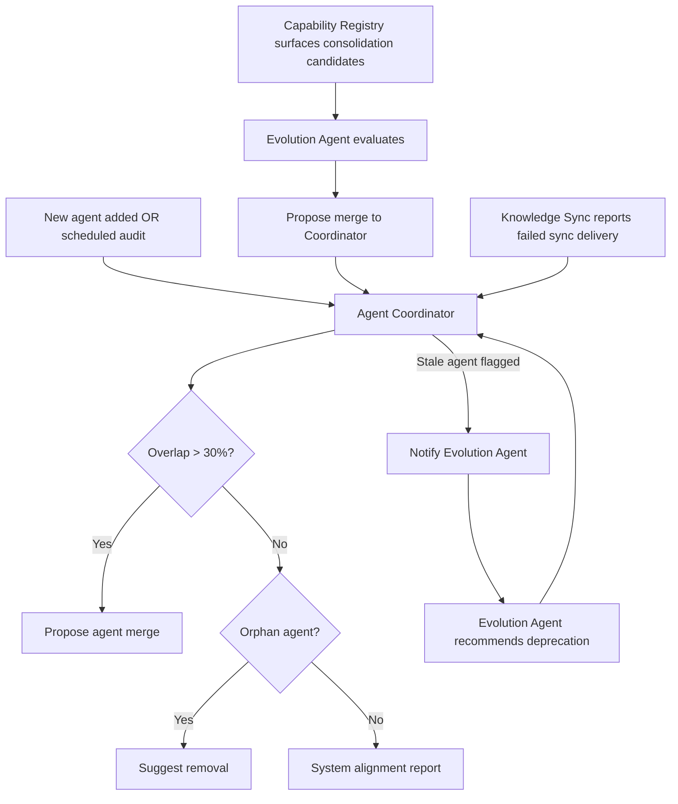
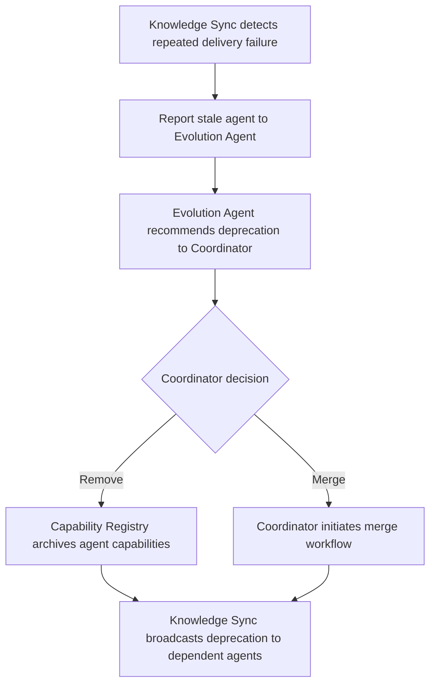

# Core Agent System — Architecture Documentation

This folder contains the **meta-agent architecture**: a self-managing system of agents whose purpose is to create, validate, track, and evolve other agents. Think of it as an "agent factory with quality control".

---

## The 6 Meta-Agent Components

| Agent | Role |
|---|---|
| [Agent Creator](agent_creator.agent.md) | Designs and generates new agents |
| [Agent Reviewer](agent_reviewer.agent.md) | Validates them before they go live |
| [Agent Coordinator](agent_coordinator.agent.md) | Keeps the whole system lean and non-redundant |
| [Evolution Agent](agent_evolution.agent.md) | Drives ongoing improvements and refactoring |
| [Capability Registry](capability_registry.agent.md) | Centralized index of what every agent can do |
| [Knowledge Sync](knowledge_sync.agent.md) | Propagates changes across the system |

## Domain Agents

| Agent | Role |
|---|---|
| [Product Agent](product_agent.agent.md) | Turns raw ideas into clear product direction; defines target user, problem, value proposition, and MVP |
| [Architect Agent](architect.agent.md) | Designs system architecture, chooses tech stack, defines API contracts and folder structure, writes ADRs — pushes for boring, reliable architecture |
| [Frontend Agent](frontend_agent.agent.md) | Builds the user-facing layer: React/Next.js components, screens, forms, client-side state, API integration, accessibility, and UI quality |
| [Backend Agent](backend.agent.md) | Implements APIs, database schemas, auth, service layer, input validation, and integration tests |
| [Reviewer/QA Agent](reviewer_qa.agent.md) | Reviews code, verifies acceptance criteria, writes test plans, generates Playwright tests, and issues QA sign-offs |
| [Growth & Marketing Agent](growth_marketing.agent.md) | Defines positioning, writes landing page copy, maps acquisition channels, drafts launch content, and produces SEO and email strategies |
| [Documentation Agent](documentation.agent.md) | Creates and maintains all project docs (README, ARCHITECTURE, API, RUNBOOK, ADRs) and all agent definitions; keeps docs synchronized with the current state of the codebase and agent system |

---

## Workflows

### Path 1 — New Agent Creation

Triggered by a human request or a detected capability gap.

### Path 2 — System Audit & Maintenance

Triggered whenever a new agent is added or a scheduled audit runs.

### Path 3 — Stale Agent Detection & Deprecation

Triggered when Knowledge Sync repeatedly fails to deliver updates to an agent.

---

## Key Design Rules

- **No duplicates** — Capability Registry enforces uniqueness; Coordinator merges overlapping agents when overlap exceeds 30%
- **No incomplete agents** — Reviewer rejects any agent missing any of the 9 required template sections (Role, Responsibilities, Trigger, Inputs, Outputs, Decision Logic, Interactions, Rules, Evolution Responsibilities)
- **Minimal footprint** — Creator prefers modular, narrow-scope agents; Coordinator removes orphans
- **Self-improving** — Evolution Agent ensures the system does not stagnate; it is the core driver of architectural improvement
- **Eventual consistency** — Knowledge Sync ensures all agents learn about changes, preventing stale logic
- **Write access control** — Only Agent Creator and Evolution Agent may write to the Capability Registry; all other agents are read-only

---

## Summary

When a need is identified, **Creator** drafts an agent → **Reviewer** validates it → **Coordinator** checks it does not duplicate anything → **Capability Registry** indexes it → **Evolution Agent** assesses system-wide impact → **Knowledge Sync** broadcasts changes to keep everything consistent.

---

## How To Use This System

Start by identifying which use case applies, then direct your prompt to the appropriate entry-point agent. The system handles routing internally — you do not need to call each agent manually.

---

### Use Case 1 — Create a New Agent

**Entry point:** Agent Creator

**Structured prompt (recommended):** Use `/create-agent <agent-name — purpose>` — defined in [create-agent.prompt.md](../prompts/create-agent.prompt.md). It auto-injects the agency plan and architecture guidelines, checks the Capability Registry for conflicts, maps interactions, enforces the 9-section template, and models subagent contracts.

**What happens next:** Creator checks overlap with Capability Registry → if no conflict, calls Reviewer → on approval, notifies Evolution Agent → Knowledge Sync broadcasts activation to the system.

---

### Use Case 2 — Check If a Capability Already Exists

**Entry point:** Capability Registry (via Agent Coordinator)

**Example prompts:**
- `"Is there already an agent that handles logging?"`
- `"Before I request a new agent, check if retry logic is already covered"`
- `"List all registered capabilities related to data validation"`

**What happens next:** Registry returns a capability map or specific match. Coordinator flags overlap if a conflict exists and prevents redundant creation.

---

### Use Case 3 — Run a System Audit

**Entry point:** Agent Coordinator

**Example prompts:**
- `"Run a full system audit and report any overlapping or orphaned agents"`
- `"Check if any agents have responsibilities that exceed 30% overlap"`
- `"Are there any agents that haven't been referenced by any other agent?"`

**What happens next:** Coordinator queries the Capability Registry → checks all agent interactions → produces a system alignment report → loops in Evolution Agent if consolidation is needed.

---

### Use Case 4 — Update or Evolve an Existing Agent

**Entry point:** Evolution Agent

**Example prompts:**
- `"The Reviewer agent should also validate that agents have an Evolution Responsibilities section — update it"`
- `"The Creator agent now needs to handle versioning. Propagate this change across the system"`
- `"Audit which agents are affected if Knowledge Sync gains a new output"`

**What happens next:** Evolution Agent evaluates system-wide impact → updates Capability Registry → sends refactoring instructions to Knowledge Sync → Coordinator approves structural changes before execution.

---

### Use Case 5 — Deprecate or Merge Agents

**Entry point:** Agent Coordinator or Evolution Agent

**Example prompts:**
- `"Agent X and Agent Y have overlapping responsibilities — propose a merge"`
- `"Deprecate the legacy monitoring agent and archive its capabilities"`
- `"We no longer need the rate-limiter agent. How do we safely remove it?"`

**What happens next:** Coordinator approves the decision → Capability Registry archives the agent's capabilities → Knowledge Sync broadcasts the deprecation to all dependent agents.

---

### Use Case 6 — Document the Project or the Agent System

**Entry point:** Documentation Agent

**Example prompts:**
- `"Update the README to reflect the latest features"`
- `"Write an ADR for the decision to use Drizzle instead of Prisma"`
- `"Sync all agent docs — some agents have changed and their definitions are stale"`
- `"Create the API docs from the current backend routes"`
- `"We added a new agent. Add it to README_agents.md and AGENTS.md"`

**What happens next:** Documentation Agent reads the relevant source files, identifies gaps or outdated content, then creates or updates the appropriate doc files. It does not orchestrate other agents — it documents the work done by them.

---

## Prompt Tips

**Do:**
- Be specific about the agent's purpose and scope when creating — vague roles get rejected by the Reviewer
- State constraints explicitly (e.g. `"should not overlap with the logging agent"`)
- Ask for a capability check before requesting a new agent to avoid wasted creation cycles
- When updating an agent, mention which agents or capabilities may be affected

**Don't:**
- Ask the Creator to create agents with undefined roles (`"make a utility agent"`)
- Skip the audit step when making large structural changes — Evolution Agent needs the full system map
- Manually edit agent files without notifying the Coordinator — it breaks capability tracking in the Registry
