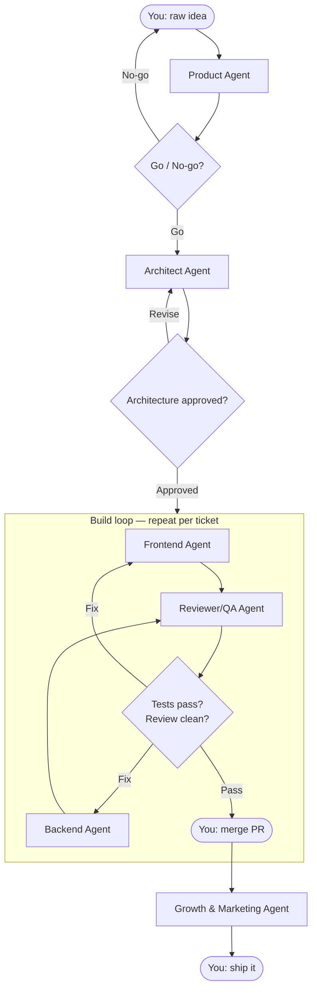

# Phase 1 Agent Workflow — Idea to Shipped MVP

This document describes the **practical, step-by-step workflow** for using the six Phase 1 agents to take a raw idea from concept to a launched micro-SaaS. You remain the decision-maker at every gate. Agents compress time; you supply judgment.

---

## Phase 1 Agent Roster

| # | Agent | Primary job |
|---|---|---|
| 1 | [Product Agent](product_agent.agent.md) | Validate the idea, define MVP scope |
| 2 | [Architect Agent](architect.agent.md) | Design system, choose stack, write ADRs |
| 3 | [Frontend Agent](frontend_agent.agent.md) | Build UI components and screens |
| 4 | [Backend Agent](backend.agent.md) | Build APIs, DB schema, auth, services |
| 5 | [Reviewer/QA Agent](reviewer_qa.agent.md) | Review code, write and run tests |
| 6 | [Growth & Marketing Agent](growth_marketing.agent.md) | Write copy, define positioning, plan launch |

---

## The Pipeline



---

## Step-by-Step

### Step 1 — Idea Intake → Product Agent

**When:** You have a rough idea and want to know if it's worth building.

**Your input:**

```text
Idea: [one sentence]
Target audience: [who has the problem]
Problem: [what pain they feel today]
Constraints:
  - Solo founder
  - Next.js (App Router) + Node.js stack
  - Must reach MVP in 2 weeks
  - Monthly subscription model
```

**What Product Agent returns** (`/requirements/` folder):

| File | Contents |
|---|---|
| `PRD.md` | Problem statement, ICP, value proposition |
| `MVP_SCOPE.md` | Exact features in / out of MVP |
| `USER_STORIES.md` | User stories with acceptance criteria |
| Validation plan | 3 experiments to test the idea before full build |
| Go / no-go recommendation | With reasoning |

**Your gate:** Read the go/no-go memo. If you disagree, push back with specific objections — the agent will revise. Only proceed when you genuinely believe the problem is real and the MVP is small enough to ship in two weeks.

---

### Step 2 — Architecture Package → Architect Agent

**When:** MVP scope is locked and approved.

**Your input:** Pass `PRD.md` and `MVP_SCOPE.md`.

```text
Read /requirements/PRD.md and /requirements/MVP_SCOPE.md.
Design the technical architecture for this MVP.
Stack constraint: Next.js (App Router) · TypeScript · Node.js (Fastify) · PostgreSQL.
For small MVPs, prefer Next.js API routes over a separate backend — introduce a standalone
Node.js/Fastify backend only if there is a concrete reason (background workers, separate
deployment unit, team split).
Prefer boring, simple architecture. No microservices. No Kubernetes.
Produce all outputs listed in your agent definition.
```

**What Architect Agent returns** (`/docs/` folder):

| File | Contents |
|---|---|
| `ARCHITECTURE.md` | System overview, component diagram, data flow |
| `ADR-001-tech-stack.md` | Why this stack was chosen |
| `ADR-002-nextjs-fullstack.md` | Whether to use Next.js API routes or a separate backend |
| `DATA_MODEL.md` | Entities, fields, relationships, constraints |
| `API_CONTRACT.md` | Endpoint list, request/response shapes, auth rules |
| Folder structure | Next.js app structure (`app/` router) + standalone backend if warranted |

**Your gate:** Verify the data model covers your MVP scope. Check that every endpoint in `API_CONTRACT.md` maps to a user story. If the architect is over-engineering (microservices, queues you don't need yet), reject and ask for a simpler version.

---

### Step 3 — Implementation Backlog

**When:** Architecture is approved.

**Who creates it:** You, using the Architect's output as input.

Break `MVP_SCOPE.md` into ordered tickets. Each ticket follows this template:

```markdown
## Ticket: [short name]

**Goal:** [one sentence]
**Files likely affected:** [list]
**Acceptance criteria:**
  - Given ... when ... then ...
**Test plan:** [what to test]
**Definition of done:** [ ] Code reviewed  [ ] Tests pass  [ ] Docs updated
```

Suggested order for most micro-SaaS:

1. Project scaffolding + CI (`create-next-app`, Tailwind, shadcn/ui, Drizzle, Clerk)
2. Auth (Clerk-managed signup / login / logout + middleware protection)
3. Core data model + DB migrations (Drizzle schema + migration files)
4. Core feature API routes (`app/api/` or standalone backend, per `ADR-002`)
5. Core feature frontend (Server Components where possible, `'use client'` only for interactivity)
6. Billing (Stripe Checkout + webhook handler + customer portal)
7. Settings page
8. Landing page (`app/page.tsx` — public, static-friendly)
9. Deployment (Vercel for the Next.js app; Railway/Fly.io for a standalone backend if used)

---

### Step 4 — Build Loop (repeat per ticket)

Each ticket goes through a mini-cycle: **plan → build → review → merge**.

#### 4a. Assign to Frontend or Backend Agent

Pick the right agent based on the ticket type.

**Backend ticket input:**

```text
Ticket: [paste ticket]
Read /docs/API_CONTRACT.md and /docs/DATA_MODEL.md before starting.
Propose a plan (files to change, approach, risks) — wait for my approval before writing code.
```

**Frontend ticket input:**

```text
Ticket: [paste ticket]
Stack: Next.js (App Router) · TypeScript · Tailwind · shadcn/ui · TanStack Query · React Hook Form · Zod.
Use Server Components by default. Add 'use client' only where client interactivity is required.
Read /docs/API_CONTRACT.md for the endpoints you'll need.
Propose a plan — wait for my approval before writing code.
```

**Your gate (before code is written):** Review the plan. Approve, or send back with corrections. Only then say: "Plan approved. Implement it."

#### 4b. Agent implements

Agent writes code, creates migration files, adds tests, updates relevant docs. For backend tickets the agent must:
- Validate all inputs with Zod
- Enforce authorization on every protected route
- Write at least one integration test per endpoint

For frontend tickets the agent must:
- Default to Server Components; add `'use client'` only where interactivity or browser APIs are needed
- Use `loading.tsx` and `error.tsx` route conventions for route-level loading and error states
- Handle empty states in every component that renders fetched data
- Pass WCAG AA contrast check
- Work on mobile viewport

#### 4c. Reviewer/QA Agent

After the agent finishes, hand the diff to the Reviewer/QA Agent:

```text
Review the following changes.
Classify every finding as: MUST FIX · SHOULD FIX · SUGGESTION.
Check: correctness, security, test coverage, edge cases, naming, complexity.
Also verify all acceptance criteria in the original ticket are met.
```

**What Reviewer/QA Agent returns:**

- Inline code comments classified by severity
- Test plan coverage gap report
- QA sign-off: **Pass** / **Pass with conditions** / **Fail**

**Your gate:** Read every MUST FIX. Decide on SHOULD FIX items yourself. Merge only after QA sign-off is Pass or Pass with conditions (and conditions are addressed).

---

### Step 5 — Launch Package → Growth & Marketing Agent

**When:** All MVP tickets are merged and the app is deployed to staging.

**Your input:**

```text
Read /requirements/PRD.md (ICP, problem, value proposition).
The MVP is built. Now prepare the launch package.
Outputs needed:
  - Landing page headline + subheadline (3 variants)
  - Feature bullets (5 max, benefit-led)
  - Primary CTA text
  - Product Hunt tagline
  - Twitter/X launch thread (opening post + 3 follow-up posts)
  - Cold outreach email template (ICP-targeted)
  - SEO: 5 target keywords + suggested meta description
```

**What Growth & Marketing Agent returns** (`/marketing/` folder):

| File | Contents |
|---|---|
| `LANDING_PAGE.md` | Copy variants, CTA, feature list |
| `LAUNCH_PLAN.md` | Sequenced launch steps (day 0, day 1, week 1) |
| `SEO.md` | Keyword targets and meta copy |
| `OUTREACH.md` | Cold email template + follow-up sequence |

**Your gate:** Pick the copy variants that sound like you. Edit anything that feels generic. Do not ship copy you wouldn't say yourself.

---

## Human-in-the-Loop Checkpoints Summary

| Gate | What you decide |
|---|---|
| After Product Agent | Go / no-go on the idea |
| After Architect Agent | Architecture approval |
| Before each code implementation | Plan approval |
| After each Reviewer/QA review | Merge / reject |
| After Growth & Marketing output | Copy selection and launch timing |

Skipping a gate to go faster is the most common way to build the wrong thing or ship broken code.

---

## Guardrails That Apply to All Agents

These rules hold across every step:

- No secrets committed to the repo (use `.env.example` only)
- Every backend endpoint validates input and enforces authorization
- No new dependencies without a written justification in the PR
- Every ticket must close with docs updated (`ARCHITECTURE.md`, `API_CONTRACT.md`, or `README.md` as appropriate)
- Tests are not optional — if a ticket genuinely cannot be tested, write a comment in the ticket explaining why

---

## Folder Map After a Full Run

```text
.
├── README.md
├── AGENTS.md
├── requirements/
│   ├── PRD.md
│   ├── MVP_SCOPE.md
│   └── USER_STORIES.md
├── docs/
│   ├── ARCHITECTURE.md
│   ├── API_CONTRACT.md
│   ├── DATA_MODEL.md
│   └── adr/
│       ├── ADR-001-tech-stack.md
│       └── ADR-002-nextjs-fullstack.md
├── marketing/
│   ├── LANDING_PAGE.md
│   ├── LAUNCH_PLAN.md
│   ├── SEO.md
│   └── OUTREACH.md
├── backlog/
│   ├── 001-scaffolding.md
│   ├── 002-auth.md
│   └── ...
├── app/                        ← Next.js App Router root
│   ├── (auth)/
│   │   ├── sign-in/
│   │   └── sign-up/
│   ├── (app)/                  ← protected routes
│   │   ├── dashboard/
│   │   └── settings/
│   ├── api/                    ← Next.js API routes (or proxy to backend)
│   │   ├── webhooks/
│   │   └── [...route]/
│   ├── layout.tsx
│   ├── page.tsx                ← landing page
│   ├── loading.tsx
│   └── error.tsx
├── components/
├── lib/
├── drizzle/                    ← schema + migrations
├── backend/                    ← standalone Node.js server (only if ADR-002 says so)
└── .github/
    ├── agents/
    └── workflows/
```

---

## What Comes After Phase 1

Once you have shipped one MVP through this pipeline, add agents in this order based on where you feel the most friction:

1. **Documentation Agent** — if keeping docs updated is slipping
2. **Security Agent** — before handling real user data or payments at scale
3. **DevOps Agent** — when manual deployment becomes a bottleneck
4. **Analytics Agent** — when you need to understand what users actually do

Do not add agents speculatively. Add them when a specific pain in the current workflow justifies the overhead.
