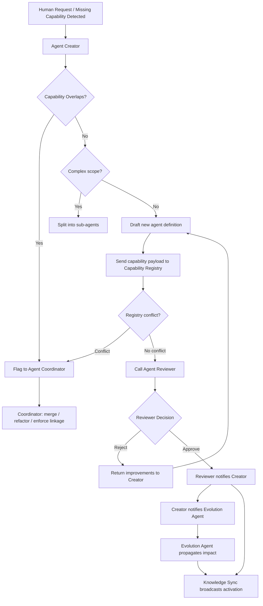
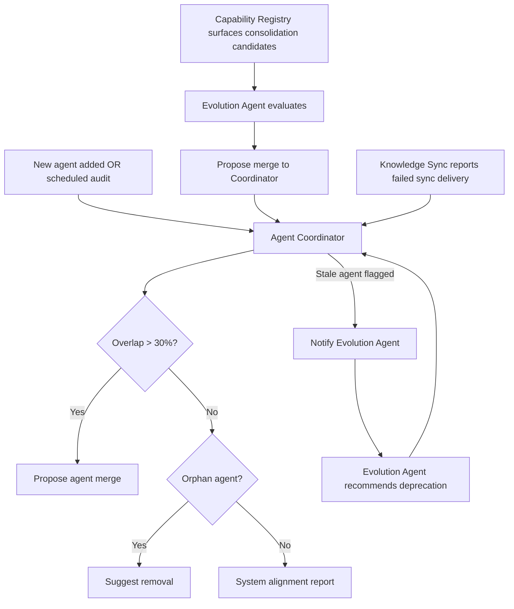
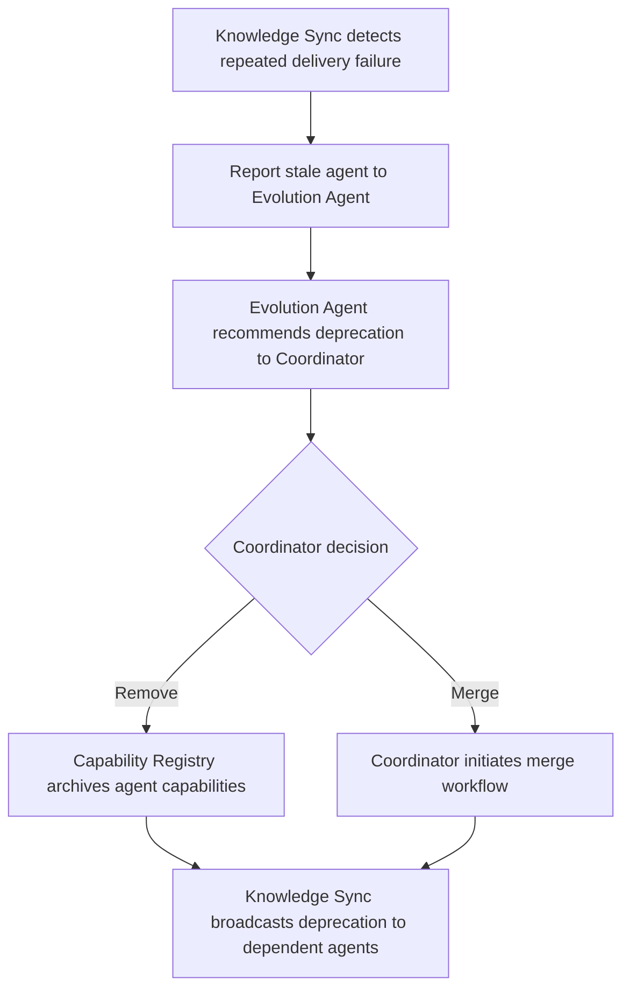

# Core Agent System — Architecture Documentation

This folder contains the **meta-agent architecture**: a self-managing system of agents whose purpose is to create, validate, track, and evolve other agents. Think of it as an "agent factory with quality control".

---

## The 6 Components

| Agent | Role |
|---|---|
| [Agent Creator](agent_creator.md) | Designs and generates new agents |
| [Agent Reviewer](agent_reviewer.md) | Validates them before they go live |
| [Agent Coordinator](agent_coordinator.md) | Keeps the whole system lean and non-redundant |
| [Evolution Agent](agent_evolution.md) | Drives ongoing improvements and refactoring |
| [Capability Registry](capability_registry.md) | Centralized index of what every agent can do |
| [Knowledge Sync](knowledge_sync.md) | Propagates changes across the system |

---

## Workflows

### Path 1 — New Agent Creation

Triggered by a human request or a detected capability gap.

### Path 2 — System Audit & Maintenance

Triggered whenever a new agent is added or a scheduled audit runs.

### Path 3 — Stale Agent Detection & Deprecation

Triggered when Knowledge Sync repeatedly fails to deliver updates to an agent.

---

## Key Design Rules

- **No duplicates** — Capability Registry enforces uniqueness; Coordinator merges overlapping agents when overlap exceeds 30%
- **No incomplete agents** — Reviewer rejects any agent missing any of the 9 required template sections (Role, Responsibilities, Trigger, Inputs, Outputs, Decision Logic, Interactions, Rules, Evolution Responsibilities)
- **Minimal footprint** — Creator prefers modular, narrow-scope agents; Coordinator removes orphans
- **Self-improving** — Evolution Agent ensures the system does not stagnate; it is the core driver of architectural improvement
- **Eventual consistency** — Knowledge Sync ensures all agents learn about changes, preventing stale logic
- **Write access control** — Only Agent Creator and Evolution Agent may write to the Capability Registry; all other agents are read-only

---

## Summary

When a need is identified, **Creator** drafts an agent → **Reviewer** validates it → **Coordinator** checks it does not duplicate anything → **Capability Registry** indexes it → **Evolution Agent** assesses system-wide impact → **Knowledge Sync** broadcasts changes to keep everything consistent.
